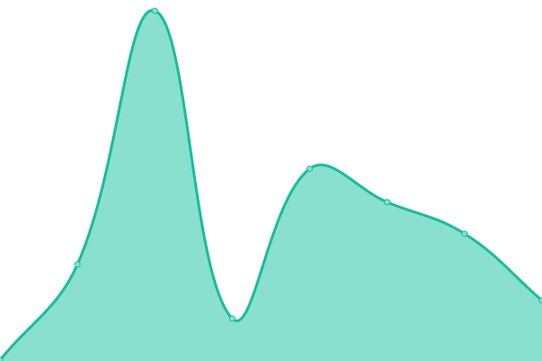

# [📈 Live Status](https://blabraes.github.io/upptime): <!--live status--> **🟩 All systems operational**

This repository contains the open-source uptime monitor and status page for [blabraes](https://blabraes.github.io/upptime), powered by [Upptime](https://github.com/upptime/upptime).

With [Upptime](https://upptime.js.org), you can get your own unlimited and free uptime monitor and status page, powered entirely by a GitHub repository. We use [Issues](https://github.com/blabraes/upptime/issues) as incident reports, [Actions](https://github.com/blabraes/upptime/actions) as uptime monitors, and [Pages](https://blabraes.github.io/upptime) for the status page.

<!--start: status pages-->
<!-- This summary is generated by Upptime (https://github.com/upptime/upptime) -->
<!-- Do not edit this manually, your changes will be overwritten -->
<!-- prettier-ignore -->
| URL | Status | History | Response Time | Uptime |
| --- | ------ | ------- | ------------- | ------ |
|  [Solicitud de EPT](https://www.solicitudept.cl/) | 🟩 Up | [solicitud-de-ept.yml](https://github.com/blabraes/mascupt/commits/HEAD/history/solicitud-de-ept.yml) | 

 642ms
     
 | 

<a href="https://blabraes.github.io/mascupt/history/solicitud-de-ept">100.00%</a>
    

|  [SACC Sur](http://sur.otecmutual.cl) | 🟩 Up | [sacc-sur.yml](https://github.com/blabraes/mascupt/commits/HEAD/history/sacc-sur.yml) | 

 489ms
     
 | 

<a href="https://blabraes.github.io/mascupt/history/sacc-sur">100.00%</a>
    

|  [SACC Minería](http://norte.otecmutual.cl/) | 🟩 Up | [sacc-mineria.yml](https://github.com/blabraes/mascupt/commits/HEAD/history/sacc-mineria.yml) | 

 492ms
     
 | 

<a href="https://blabraes.github.io/mascupt/history/sacc-mineria">100.00%</a>
    

|  [SACC Clientes Diversos](http://centro.otecmutual.cl) | 🟩 Up | [sacc-clientes-diversos.yml](https://github.com/blabraes/mascupt/commits/HEAD/history/sacc-clientes-diversos.yml) | 

 376ms
     
 | 

<a href="https://blabraes.github.io/mascupt/history/sacc-clientes-diversos">100.00%</a>
    

|  [MACC](https://macc.masesorias.cl/) | 🟩 Up | [macc.yml](https://github.com/blabraes/mascupt/commits/HEAD/history/macc.yml) | 

 710ms
     
 | 

<a href="https://blabraes.github.io/mascupt/history/macc">100.00%</a>
    

|  [Matriz de Riesgo Individual](http://mri.masesorias.cl) | 🟩 Up | [matriz-de-riesgo-individual.yml](https://github.com/blabraes/mascupt/commits/HEAD/history/matriz-de-riesgo-individual.yml) | 

 414ms
     
 | 

<a href="https://blabraes.github.io/mascupt/history/matriz-de-riesgo-individual">100.00%</a>
    

|  [Moodle Clientes Diversos](https://cursos.mcap.cl/) | 🟩 Up | [moodle-clientes-diversos.yml](https://github.com/blabraes/mascupt/commits/HEAD/history/moodle-clientes-diversos.yml) | 

 300ms
     
 | 

<a href="https://blabraes.github.io/mascupt/history/moodle-clientes-diversos">100.00%</a>
    

|  [Portal eCommerce](https://mcap.cl/) | 🟩 Up | [portal-e-commerce.yml](https://github.com/blabraes/mascupt/commits/HEAD/history/portal-e-commerce.yml) | 

 1127ms
     
 | 

<a href="https://blabraes.github.io/mascupt/history/portal-e-commerce">100.00%</a>
    

<!--end: status pages-->

[**Visit our status website →**](https://blabraes.github.io/mascupt)

## 📄 License

- Powered by: [Upptime](https://github.com/upptime/upptime)
- Code: [MIT](./LICENSE) © [blabraes](https://blabraes.github.io/upptime)
- Data in the `./history` directory: [Open Database License](https://opendatacommons.org/licenses/odbl/1-0/)
